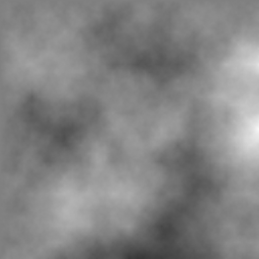

# Diamod Square
This is a TypeScript implementation of the classic Diamond-Square Algorithm for 2D height maps.

## GETTING STARTED

### NPM

> npm install sibvrv/DiamondSquare

### Available scripts

* **build** - transpile TypeScript to ES5

### Example

```typescript
import {DiamondSquare} from 'DiamondSquare'

const size = 512;
const range = 32768;

const ds = new DiamondSquare(size);
ds.step(0, 0, size - 1, size - 1, range);

// ds.map - Float32Array
```

### Preview


